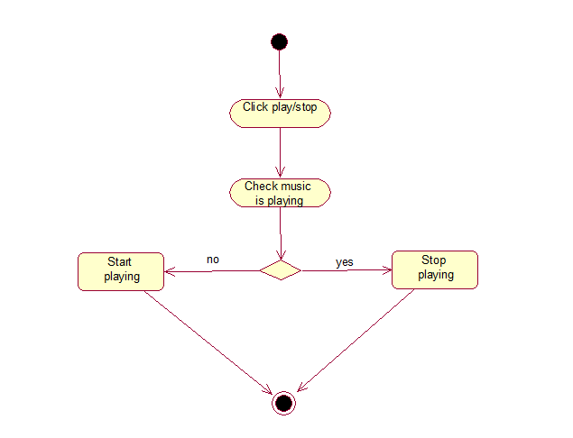
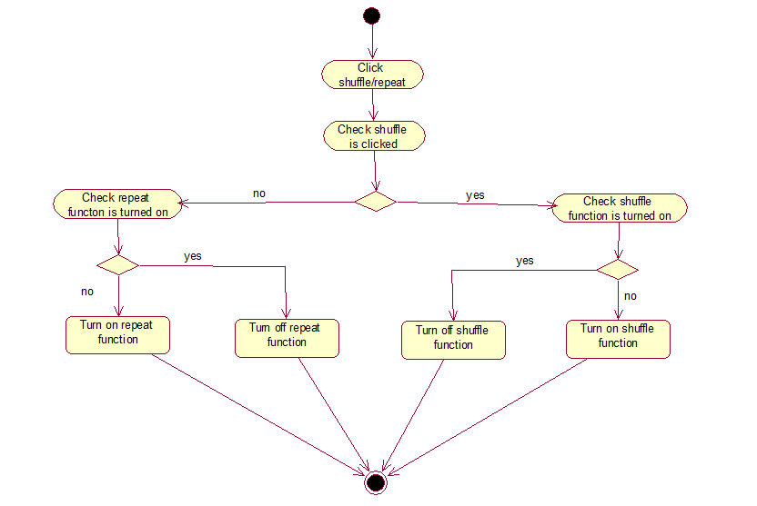

# Диаграммы активности
---

# Содержание
1 [Остановить/продолжить воспроизведение музыки](#stop_play) 
2 [Перейти к следующей/предыдущей композиции в списке](#next_previous) 
3 [Изменить уровень громкости](#change_volume) 
4 [Включить/отключить функции перемешивания и повтора композиций](#shuffle_repeat) 
5 [Создание плейлиста](#create_playlist) 
6 [Добавить файлы в плейлист](#add_files) 
7 [Удалить плейлист](#delete_playlist)

<a name="stop_play"/>

## 1. Остановить/продолжить воспроизведение музыки
При нажатии на кнопку "Play/stop" приложение либо останавливает воспроизведение,
либо продолжает, при этом меняя состояние кнопки.

<a name="next_previous"/>

## 2. Перейти к следующей/предыдущей композиции в списке
При нажатии на кнопку "далее" или "назад" приложение обрабатывает нажатие: определяет, 
какая из кнопок была нажата и совершает соответсвующую обработку. При удачной попытке 
текущая играющая композиция будет изменена.

<a name="change_volume">

## 3. Изменить уровень громкости
После передвижения ползунка громкости пользователем программа анализирует его положение
и выставляет уровень громкости в соответствии с процентным отношением величины положения
ползунка в шкале его местонахождения.

<a name="shuffle_repeat"/>

## 4. Включить/отключить функции перемешивания и повтора композиций
При нажатии на кнопку "перемешать" или "повтор" приложение обрабатывает нажатие: определяет,
какая из кнопок была нажата и переключает состояние функции, соответствующей нажатой кнопке.

<a name="create_playlist"/>

## 5. Создать плейлист
После нажатия на кнопку "добавить плейлист" в виде плюса приложение открывает окно ввода
имени нового плейлиста, и после подтверждения пользователем ввода имени проверяет его валидность, 
и, в случае прохождения проверки, создает новый плейлист.

<a name="add_files"/>

## 6. Добавить файлы в плейлист
После выбора функции "добавить файлы в плейлист" приложение открывает окно файлового менеджера,
в котором пользователь должен выбрать файлы, которые хочет добавить. После подтверждения
пользователя об окончании выборки приложение отсеивает файлы, которые не могут находиться в
плейлисте (в основном по причине неподдерживаемости форматов), а затем добавляет оставшиеся
в плейлист, к которому была применена данная функция.

<a name="delete_playlist"/>

## 7. Удалить плейлист
После выбора функции "удалить плейлист" пользователем приложение удаляет данный плейлист из
списка, а также затем удаляет файл, связанный с этим плейлистом, в котором хранилась информация
об списке композиций, состоявших в данном плейлисте.

