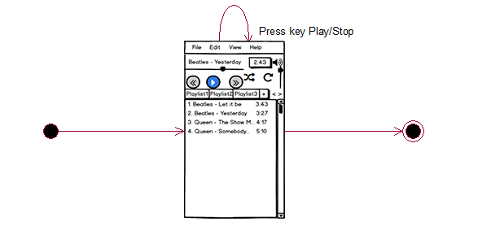
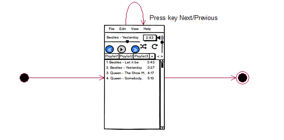
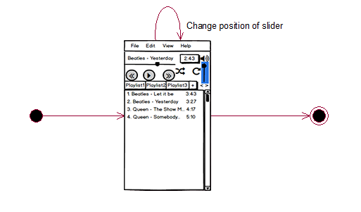
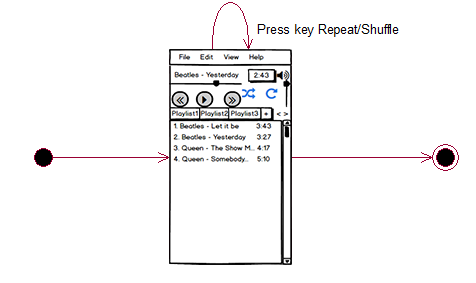
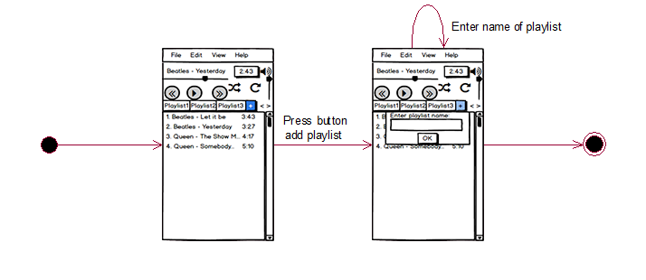
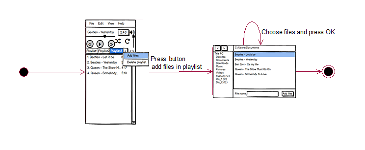
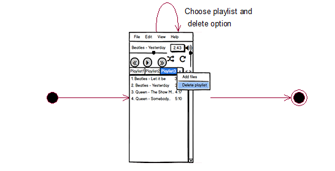

# Содержание
1. [Остановить/продолжить воспроизведение музыки](#stop_play) 
2. [Перейти к следующей/предыдущей композиции в списке](#next_previous) 
3. [Изменить уровень громкости](#change_volume) 
4. [Включить/отключить функции перемешивания и повтора композиций](#shuffle_repeat) 
5. [Создание плейлиста](#create_playlist) 
6. [Добавить файлы в плейлист](#add_files) 
7. [Удалить плейлист](#delete_playlist) 

<a name="stop_play"/>

## 1. Остановить/продолжить воспроизведение музыки

<a name="next_previous"/>

## 2. Перейти к следующей/предыдущей композиции в списке

<a name="change_volume"/>

## 3. Изменить уровень громкости

<a name="shuffle_repeat"/>

## 4. Включить/отключить функции перемешивания и повтора композиций

<a name="create_playlist"/>

## 5. Создание плейлиста

<a name="add_files"/>

## 6. Добавить файлы в плейлист

<a name="delete_playlist"/>

## 7. Удалить плейлист

