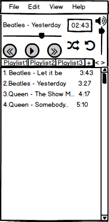

# Project requirements

# Content

1 [Introduction](#introduction) 
2 [User requirements](#user_requirements) 
2.1 [Software requirements](#software_interfaces) 
2.2 [User interface](#user_interface) 
2.3 [User characteristics](#user_characteristics) 
2.3.1 [Application audience](#application_audience) 
2.4 [Assumptions and dependencies](#assumptions_and_dependencies) 
3 [System requirements](#system_requirements) 
3.1 [Functional requirements](#functional_requirements) 
3.2 [Non-functional requirements](#non_functional_requirements) 
3.2.1 [Software quiality attributes](#software_quality_attributes) 
3.2.1.1 [Use conveniences requirements](#use_conveniences_requirements) 
3.2.1.2 [Security requirements](#security_requirements) 
3.2.2 [Restrictions](#restrictions)

### Glossary
* JSON - file format for transmitting data, which is based on JavaScript.
* JavaFX - software platform for creating and delivering applications, which is based on Java.

<a name = "introduction"/>

# 1 Introduction
EnjoyPlayer will be audioplayer, where user could listen to music of different formats and create playlists, which will help to group content and simplify content loading process after application opening.

<a name = "user_requirements"/>

# 2 User requirements

<a name = "software_interfaces"/>

## 2.1 Software requirements
Project will be written on Java. User interface will be realised with JavaFX. JSON will be used for storing application data.

<a name = "user_interface"/>

## 2.2 User interface

| Function | Action | 
|:---|:---|
| Stop/play music | Press button Play | 
| Next/previous track in list | Press button forward/back |
| Go to any time in audiotrack | Press slider, which represent current music time, in appropriate spot |
| Change audio volume | Set appropriate value on slider on right side of window by shifting it |
| Create playlist | Press button "plus" by right side of playlists |
| Turn on/off music shuffle | Press button with crossing arrows |
| Turn on/off repeating of playlist | Press button with circle arrow |

<a name = "user_characteristics"/>

## 2.3 User characteristics

<a name = "application_audience"/>

### 2.3.1 Application audience
People who want to listen to favorite music from drive, not in the Internet. And also who want to have simple and understandable interface with basic functionality.

<a name = "assumptions_and_depedencies"/>

## 2.4 Assumptions and dependencies
1. Only music from drive in current operating system (actual for PC with several OS) can be played;
2. Some rare formats can not been identified.

<a name = "system_requirements"/>

# 3 System requirements

<a name = "functioinal_requirements"/>

## 3.1 Functional requirements

Capabilities user has:
* Play audiocontent;
* Create playlists;
* Management playlists, which were created;
* Shuffle tracks function;
* Repeat playlist function.

<a name = "non_functional_requirements"/>

## 3.2 Non-functional requirements

<a name = "software_quality_attributes"/>

### 3.2.1 Software quality attributes
The most important quality attributes are simple and understandable interface, stable play of audiocontent of different formats without gaps and breaks.

<a name = "use_conveniences_requirements"/>

#### 3.2.1.1 Use conveniences requirements
1. Playback without breaks and gaps;
2. Intuitively understandable and simple interface;
3. Automatic identify and adjustment to music of different formats;
4. Comfortable management over a lot of playlists.

<a name = "security_requirements"/>

#### 3.2.1.2 Security requirements
App stores playlists in app folder, it isolates app data from file system.

<a name = "restrictions"/>

### 3.2.2 Restrictions
* App is realised with Java;
* User can listen to music, which was opened manually or load from playlist, only from drive, which is identified by current operating system.