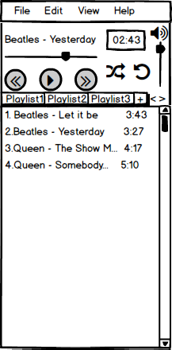

# Требования к проекту

# Содержание

1 [Введение](#introduction) 
2 [Требования пользователя](#user_requirements) 
2.1 [Программные интерфейсы](#software_interfaces) 
2.2 [Интерфейс пользователя](#user_interface) 
2.3 [Характеристики пользователей](#user_characteristics) 
2.3.1 [Аудитория приложения](#application_audience) 
2.4 [Предположения и зависимости](#assumptions_and_dependencies) 
3 [Системные требования](#system_requirements) 
3.1 [Функциональные требования](#functional_requirements) 
3.2 [Нефункциональные требования](#non_functional_requirements) 
3.2.1 [Атрибуты качества](#software_quality_attributes) 
3.2.1.1 [Требования к удобству использования](#use_conveniences_requirements) 
3.2.1.2 [Требования к безопасности](#security_requirements) 
3.2.2 [Ограничения](#restrictions)

### Глоссарий
* JSON - текстовый формат обмена данными, основанный на JavaScript.
* JavaFX - платформа на основе Java для создания приложений с насыщенным графическим интерфейсом.

<a name = "introduction"/>

# 1 Введение
В проекте EnjoyPlayer будет реализован аудиоплеер. В данном приложении пользователь сможет слушать музыку различных форматов, а также создавать плейлисты, чтобы было удобнее группировать прослушиваемый контент, а также чтобы упростить процесс загрузки аудиоконтента в плеер после открытия приложения.

<a name = "user_requirements"/>

# 2 Требования пользователей

<a name = "software_interfaces"/>

## 2.1 Программные интерфейсы
Проект будет написан на языке Java. Пользовательский интерфейс будет реализован с помощью библиотеки JavaFX. Для хранения данных будут использованы файлы формата JSON.

<a name = "user_interface"/>

## 2.2 Интерфейс пользователя

| Функция | Действие | 
|:---|:---|
| Остановить/продолжить воспроизведение композиции | Нажать на кнопку Play | 
| Перейти к предыдущему/следующему треку в списке | Нажать на кнопку далее/назад |
| Перейти к любому времени композиции | Нажать на ползунок, отражающий текущее время проигрывания, в соответсвующем месте |
| Изменить громкость воспроизведения аудиоконтента | Установить нужное значение на ползунке справа, передвигая его |
| Создать плейлист | Нажать на кнопку "плюс" справа от плейлистов |
| Включить/отключить перемешивание треков | Нажать на кнопку с перекрещенными стрелками |
| Включить/отключить повторное воспроизведение плейлиста | Нажать на кнопку с круговой стрелкой |

<a name = "user_characteristics"/>

## 2.3 Характеристики пользователей

<a name = "application_audience"/>

### 2.3.1 Аудитория приложения
Люди, которые хотят слушать свою любимую музыку с носителя, а не в сети. При этом желают иметь простой и интуитивно понятный интерфейс с базовым, но достаточным функционалом.

<a name = "assumptions_and_depedencies"/>

## 2.4 Предположения и зависимости
1. Воспроизвести можно только ту музыку, которая доступна в данной операционной системе (актуально для устройств с несколькими операционными системами);
2. Некоторые редкие форматы аудиоконтента могут не поддерживаться.

<a name = "system_requirements"/>

# 3 Системные требования

<a name = "functioinal_requirements"/>

## 3.1 Функциональные требования

Пользователю предоставлены возможности :
* Воспроизведение аудиоконтента;
* Создание плейлистов;
* Управление ранее созданными плейлистами;
* Функция перемешивания композиций из списка;
* Функция повторного воспроизведения плейлиста.

<a name = "non_functional_requirements"/>

## 3.2 Нефункциональные требования

<a name = "software_quality_attributes"/>

### 3.2.1 Атрибуты качества
Важными атрибутами являются простой и понятный интерфейс, работа без срывов даже с тяжелыми форматами музыки.

<a name = "use_conveniences_requirements"/>

#### 3.2.1.1 Требования к удобству использования
1. Независание музыки во время исполнения;
2. Интуитивно понятный и простой интерфейс;
3. Автоматическая подстройка программы под различные форматы аудиоконтента;
4. Удобное управление множеством плейлистов.

<a name = "security_requirements"/>

#### 3.2.1.2 Требования к безопасности
Приложение хранит плейлисты в папке программы, изолируя данную информацию от файлов системы.

<a name = "restrictions"/>

### 3.2.2 Ограничения
* Приложение реализовано на языке Java;
* Слушать можно только музыку с носителя, которую распознает данная операционная система, предварительно открыв ее в приложении или загрузив плейлист.